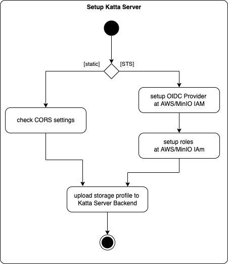
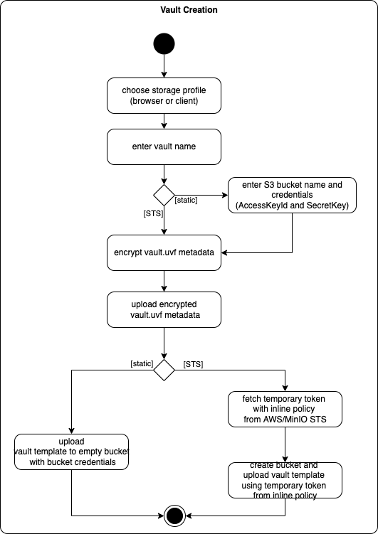
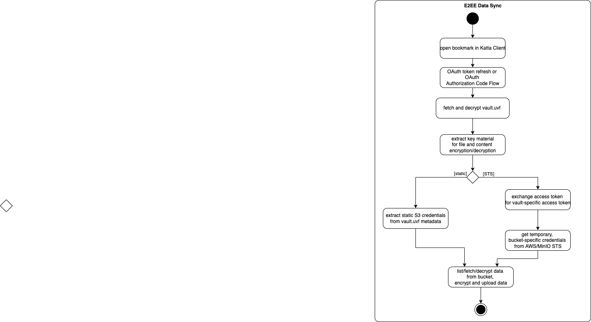

# Katta Overview

> [!NOTE]  
> This document gives an overview over Katta usage scenarios.

## Katta Storage Providers

Katta currently supports two S3 storage providers:

* AWS
* MinIO

## Katta S3 Modes

Katta currently supports two modes for both S3 providers:

* static: use an existing S3 bucket and share the static credentials among vault users
* STS: use STS to do have fine-grained permissions
    * vault creation: the new bucket is created in Katta Server backend, the user passes a temporary token with limited permissions to the backend
    * storage access: only vault users can access storage

## Katta Setup

The following diagram illustrates the flow of actions to setup Katta Server in the two modes:

## Vault Creation

The following diagram illustrates the flow of actions to create a vault creation in the two modes:

## E2EE Data Sync

The following diagram illustrates the flow of actions to sync data in an end-to-end-encrypted way:

## Glossary

| Term                                                                                                                                                                                        | Description                                                                                                                             |
|---------------------------------------------------------------------------------------------------------------------------------------------------------------------------------------------|-----------------------------------------------------------------------------------------------------------------------------------------|
| Client [Bookmark](https://docs.cyberduck.io/cyberduck/bookmarks/)                                                                                                                           | Defines a sync endpoint in Katta client at two levels: Katta servers and vaults.                                                        |
| Client [Protocol](https://docs.cyberduck.io/protocols/)                                                                                                                                     | The two Katta modes are defined in two Cyberduck protocols.                                                                             |
| Client [Connection Profile](https://docs.cyberduck.io/protocols/profiles/)                                                                                                                  | Used internally in Client for the two modes and for storage profiles.                                                                   |
| Katta Storage Profile                                                                                                                                                                       | Uploaded by a Katta Server admin initially for each storage provider endpoint and mode.                                                 |
| [uvf vault metadata](https://github.com/encryption-alliance/unified-vault-format/blob/develop/vault%20metadata/README.md) `vault.uvf`  [JWE](https://datatracker.ietf.org/doc/html/rfc7516) | Contains all the information required to create a vault bookmark in the client (reference to storage profile, static credentials etc.). |
