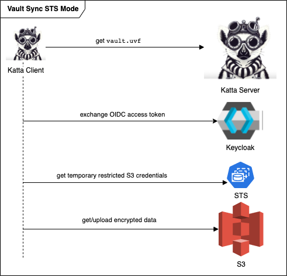
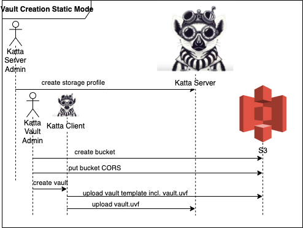
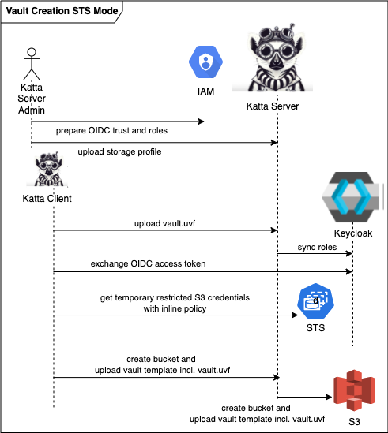
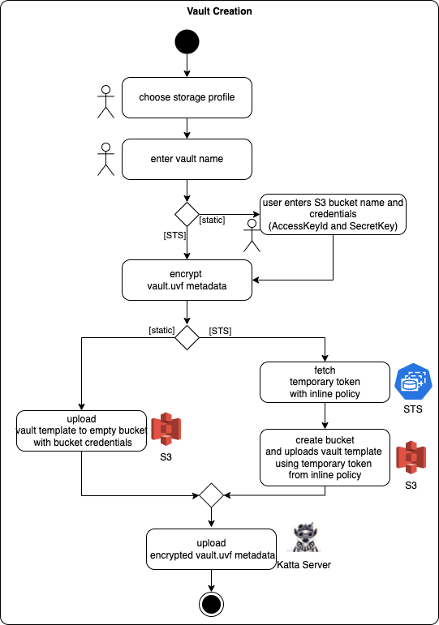
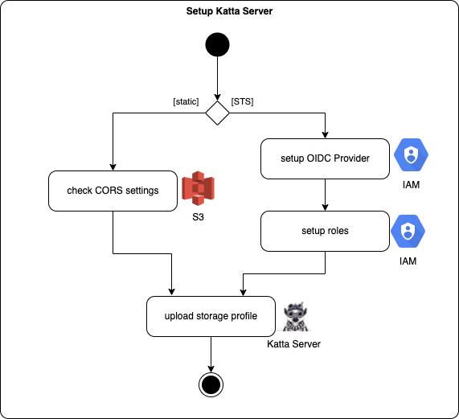
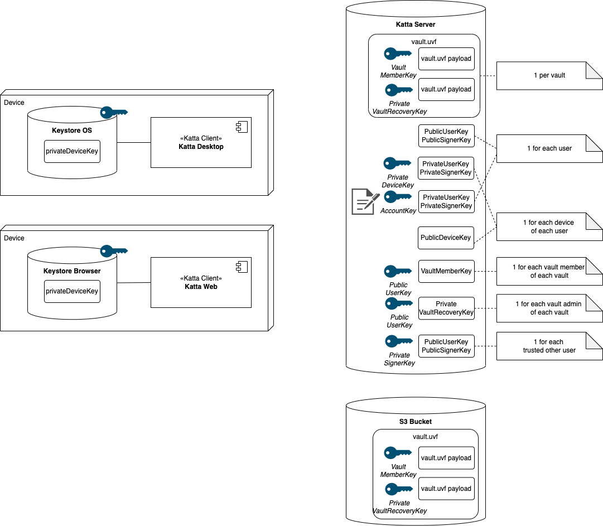

# Katta Overview

> [!NOTE]  
> This document gives an overview over Katta usage scenarios.

Katta consists of the following components:

* Katta Clients:
  * Katta Desktop (Client)
  * Katta Web (Client)
* Katta Server:
  * Katta (Server) Backend
  * Keycloak

Katta Desktop Client is based on [Mountain Duck](https://mountainduck.io/),
Katta Web Client and Katta Server is based on [Cryptomator Hub](https://github.com/cryptomator/hub/).

## Concepts

### Katta Vaults

In Katta, data is shared in units called vaults. Only members of the vault have access to the key material that allows to decrypt the data.

* The vault keys are uploaded to Katta Server only after encryption on your machine.
* Your data is uploaded to the storage providers only after encryption on your machine using the vault's content encryption keys.

> [!IMPORTANT]  
> One vault corresponds to one bucket.

### Katta S3 Modes

Katta currently supports two modes for both S3 providers:

* *Static Mode*: use an existing S3 bucket and share the static credentials among vault users
    * the vault template is uploaded with static credentials
* *STS Mode*: use STS to have fine-grained permissions
    * vault creation: the user passes a temporary token with limited permissions to the backend, Katta Server backend creates the bucket and uploads the vault
      template
    * storage access: only vault users can access storage

If you want to use static mode, you can use any S3 Provider - see the [list](https://docs.cyberduck.io/protocols/s3/).

Not all S3 providers implement the [STS API](https://docs.aws.amazon.com/STS/latest/APIReference/welcome.html).
If you want to use Katta STS mode, Katta currently supports two S3 object storage services :

* [AWS](https://aws.amazon.com/s3/)
* [MinIO](https://min.io/)

### Katta Storage Profiles

Katta Storage Profiles define the possible storage locations where users can create vaults. E.g.
there may be multiple storage profiles for different S3 endpoints, different Katta Modes, different default regions.
See [SETUP_KATTA_SERVER.md](SETUP_KATTA_SERVER.md) for the configuration options.

### Universal Vault Format and Vault Metadata `vault.uvf`

The [Universal Vault Format](https://github.com/encryption-alliance/unified-vault-format) defines a common vendor-independent standard for encrypted directories
on a per-file basis. It is based on year-long proven [Cryptomator Vault Format](https://docs.cryptomator.org/en/latest/misc/vault-format-history/).
It will allow in the future for implementation
of [Key Rotation](https://github.com/encryption-alliance/unified-vault-format/blob/develop/vault%20metadata/key-rotation.md)
(see also [Security Architecture](https://github.com/cryptomator/docs/pull/55/files)).

[Vault Metadata (`vault.uvf`)](https://github.com/encryption-alliance/unified-vault-format/tree/develop/vault%20metadata#readme)
https://github.com/cryptomator/docs/pull/55)
contains the key material to decrypt and encrypt data. uvf allows for vendor-specific extension points:

* `org.cryptomator.automaticAccessGrant` (upstream): defines whether automatic access grant is enable for this vault and defines the maximum length (
  see [Web of Trust](https://github.com/cryptomator/hub/pull/281)).
* `cloud.katta.storage` (Katta only): defines the bucket location and further storage settings
  like [S3 Versioning](https://docs.aws.amazon.com/AmazonS3/latest/userguide/Versioning.html); the user will have access to their vaults in Katta Client
  by [Bookmarks](https://docs.cyberduck.io/cyberduck/bookmarks/). So the information required to create such bookmarks is contained in this section of the
  encrypted `vault.uvf` file (which is also stored encrypted in the Katta Server for convenience).

### Katta Roles

* Katta User: the `user` role allows to login to Katta Server Frontend
* Katta Vault Creator: users allowed to create vault
* Katta Admin: users with administrative permissions in the Katta Server Frontend / Katta Server Backend API, they can configure the Katta Server and they can
  upload storage profiles.
* Katta Vault Member: the key material to decrypt and encrypt the vault data is shared with Vault Members.
* Katta Vault Admin: the vault creator is by default the first vault admin; the vault admin has access to the
  vault's [recovery code](https://docs.cryptomator.org/en/latest/hub/vault-recovery/#hub-vault-recovery)
* Katta Server Admin: technical administrator of the databases and; zero-trust means the data can never be decrypted by a person having access to the database
  or the server running the Katta Server or to the physical storage (unless the Katta Server admin is also a Vault Member, of course).

## E2E-Encyrpted Data Sync in Static and STS mode

The following diagram illustrates the interactions when Katta Client syncs data in vault in *Static Mode*:

The following diagram illustrates the interactions when Katta Client syncs data in a vault in *STS Mode*:

The following diagram illustrates the flow of actions to sync data in an end-to-end-encrypted way:

## Vault Creation in Static and STS mode

The following diagram illustrates the interactions when a user
creates a vault in *Static Mode*:

The following diagram illustrates the interactions when a user creates a
vault in *STS Mode*:

The following diagram illustrates the flow of actions to create a vault in the two modes:

## Katta Setup

The following diagram illustrates the flow of actions to setup Katta Server in both modes:

## Comparison Katta Client and Katta Server Frontend

| Feature                                | Katta Server Frontend | Katta Client |
|----------------------------------------|-----------------------|--------------|
| create vault static                    | ✅                     | ✅            |
| create vault STS                       | ✅                     | ✅            |
| list vaults                            | ✅                     | ✅            |
| decrypt vault data                     | ❌                     | ✅            |
| automatic access grant                 | ❌                     | ✅            |
| view details storage profiles          | ✅                     | ❌            |
| initial setup (user keys)              | ✅                     | ✅            |
| View/reset setup code                  | ✅                     | ❌            |
| Manage Signature Chains (Web of Trust) | ✅                     | ❌            |

## Glossary

| Term                                                                                                                                                                                        | Description                                                                                                                             |
|---------------------------------------------------------------------------------------------------------------------------------------------------------------------------------------------|-----------------------------------------------------------------------------------------------------------------------------------------|
| Client [Bookmark](https://docs.cyberduck.io/cyberduck/bookmarks/)                                                                                                                           | Defines a sync endpoint in Katta client at two levels: Katta servers and vaults.                                                        |
| Client [Protocol](https://docs.cyberduck.io/protocols/)                                                                                                                                     | The two Katta modes are defined in two Cyberduck protocols.                                                                             |
| Client [Connection Profile](https://docs.cyberduck.io/protocols/profiles/)                                                                                                                  | Used internally in Client for the two modes and for storage profiles.                                                                   |
| Katta Storage Profile                                                                                                                                                                       | Uploaded by a Katta Server admin initially for each storage provider endpoint and mode.                                                 |
| [uvf vault metadata](https://github.com/encryption-alliance/unified-vault-format/blob/develop/vault%20metadata/README.md) `vault.uvf`  [JWE](https://datatracker.ietf.org/doc/html/rfc7516) | Contains all the information required to create a vault bookmark in the client (reference to storage profile, static credentials etc.). |

## Key Overview

The following diagram shows the cryptographic keys used in Katta, where they are stored and how they are encrypted/signed:

For more details, refer to [Cryptomator Docs](https://github.com/cryptomator/docs/pull/55/files).