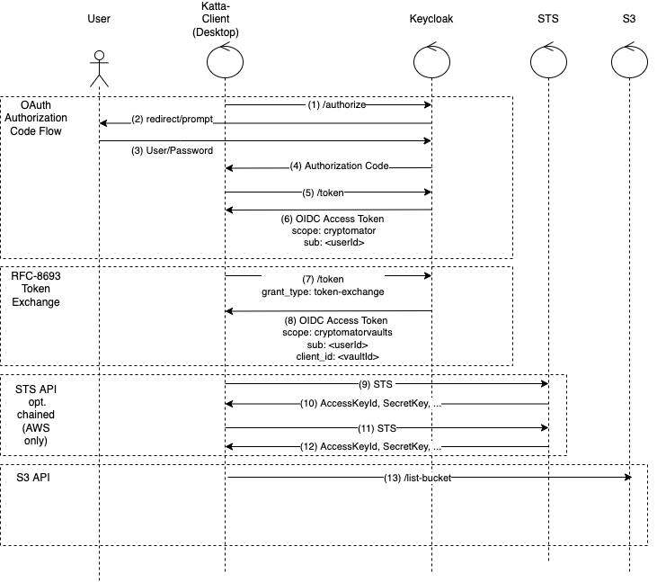
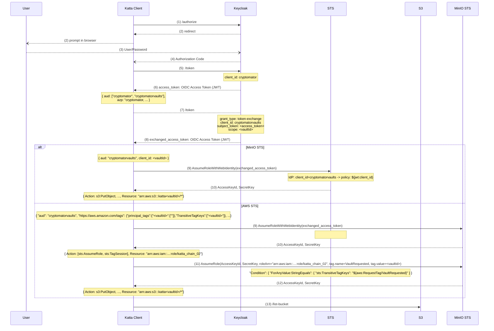
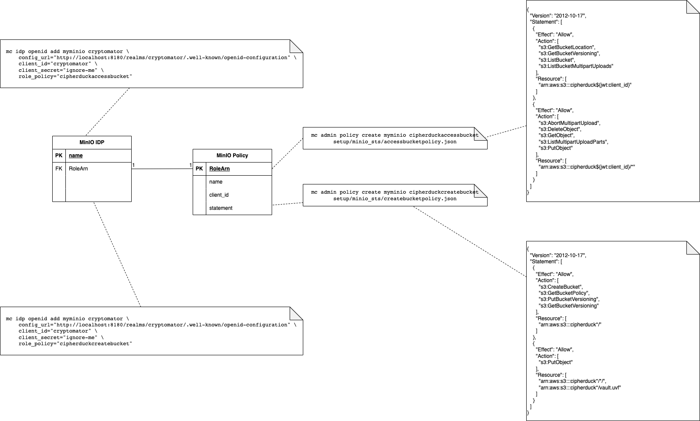
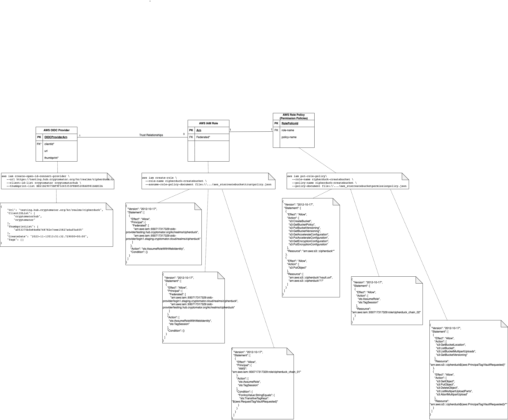
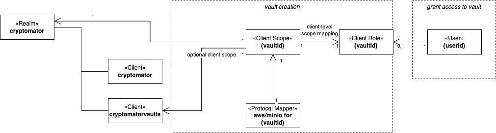

# Katta Token Management

> [!NOTE]  
> This document describes the use of scoped tokens for storage access on an in-depth conceptual level.
>
> See [OVERVIEW.md](OVERVIEW.md) for a mid-level conceptual overview of Katta.

> [!CAUTION]
> This document has missing parts and needs double-checking whether it reflects the latest code version.

## Scoped Tokens for Katta S3 STS Storage Access Control

### Motivation

[AWS STS AssumeRoleWithWebIdentity](https://docs.aws.amazon.com/STS/latest/APIReference/API_AssumeRoleWithWebIdentity.html)
and [MinIO STS AssumeRoleWithWebIdentity](https://min.io/docs/minio/linux/developers/security-token-service/AssumeRoleWithWebIdentity.html#minio-sts-assumerolewithwebidentity)
allow to request temporary, limited-privilege credentials for users.
To get fine-grained control access to S3 storage, we use OIDC access tokens scoped to
one vault and use them to get access to one bucket (i.e. one vault) only.
In order to keep our components zero-trust, we use no privileged broker to update [IAM roles](https://docs.aws.amazon.com/IAM/latest/UserGuide/id_roles.html).
when vaults are created or users are given access to vaults,
i.e. we use a static mapping to exchange OIDC access tokens for temporary S3 credentials.
The static mapping uses a claim in the access token to issue temporary credentials with a dynamic role giving access to the vault's bucket only.

AWS STS imposes 2048 KB size limit[^1] on the OIDC tokens sent to them[^2]. So the OIDC token must not grow in the number of vaults.
Therefore, we use [RFC 8693 token exchange](https://www.rfc-editor.org/rfc/rfc8693) to get fine-grained access tokens before we go to STS.

[^1]: https://docs.aws.amazon.com/IAM/latest/UserGuide/reference_iam-quotas.html#reference_iam-limits-entity-length &rarr; `Role session policies`

[^2]: https://docs.amazonaws.cn/en_us/AmazonS3/latest/API/ErrorResponses.html#S3AccessGrantsErrorCodeList &rarr; `Serialized token too large for session`

### High-Level Description

Katta S3 STS is based on the following components and their responsibilities:

- _Katta Server Backend_: synchronizes vault access to Keycloak
- _Keycloak_: provides tokens based on the user's roles
- _AWS/MinIO IAM_: gives trust to Keycloak realms and defines the mapping from claims issued to dynamic roles
- _AWS/MinIO STS_: issues temporary credentials with privileges defined in IAM
- _AWS/MinIO S3_: checks the access right of the temporary credentials to give access to S3 buckets

Katta S3 STS combines the following standard APIs:

1. [OAuth 2.0 Authorization Code Grant](https://www.rfc-editor.org/rfc/rfc6749#section-4.1): the user enters user and password in Keycloak to get OIDC access
   and refresh tokens
2. [OAuth 2.0 Token Exchange](https://www.rfc-editor.org/rfc/rfc8693.html): the OIDC access token is exchanged for vault-specific OIDC access token
3. [AssumeRoleWithWebIdentity](https://docs.aws.amazon.com/STS/latest/APIReference/API_AssumeRoleWithWebIdentity.html): the OIDC access token is exchanged for
   temporary credentials giving access to one vault only
4. [S3 API](https://docs.aws.amazon.com/AmazonS3/latest/API/API_ListObjectsV2.html): S3 evaluates the credentials before data can be retrieved

### Intermediate-Level Description

At an intermediate Level, the following diagram shows

https://sparxsystems.com/resources/tutorials/uml2/sequence-diagram.html
https://mermaid.js.org/syntax/sequenceDiagram

1. User opens vault in Katta client, client opens browser.
2. Keycloak redirects user to login and authorization prompt.
3. User enters user name and password.
4. Keycloak redirects user back to Katta client with single-use authorization code.
5. Katta client calls `/token` endpoint with authorization code.
6. Keycloak returns OIDC access token and refresh token for client `cryptomator`
7. Katta client sends OIDC access token for client `cryptomator` exchange to `audience: cryptomatorvaults` client using `/token` endpoint with
   `grant_type: urn:ietf:params:oauth:grant-type:token-exchange`, requesting `scope: <vaultId>`.
8. Keycloak returns access token for OIDC access token with vault-specific claims added by protocol mappers in the requested scope.
9. Katta client sends scoped OIDC access token to
   STS [AssumeRoleWithWebIdentity](https://docs.aws.amazon.com/STS/latest/APIReference/API_AssumeRoleWithWebIdentity.html).
10. STS returns temporary `AccesKeyId`, `SecretAccessKey` and `SessionToken`.
    * AWS: the temporary role is tagged with the `vaultId`.
    * MinIO: the credentials allow access to one bucket.
11. AWS only: Katta client sends AWS credentials to STS in order to assume role.
12. AWS only: AWS sends credentials to access giving access to one bucket from the session tags.
13. Katta client access S3 storage with temporary `AccesKeyId`, `SecretAccessKey` and `SessionToken`.

### Detailed Description

TODO sequence diagram with example JSONs/tokens for the steps above, maybe add cli calls?

* AWS: token contains `https://aws.amazon.com/tags` claim
* MinIO: token contains `client_id` claim

## IAM Data Model

### MinIO IAM Data Model

The following diagram shows the data model we use
for [Policy-Based Access Control](https://min.io/docs/minio/linux/administration/identity-access-management/policy-based-access-control.html) with MinIO STS:

OpenID Identities and Policies are installed once during Katta Server Setup (or before the corresponding storage profile(s) for a new storage location are
uploaded).

An STS request with a token issued by a configured OpenID Identity (defined by `config_url`, `client_id`, `client_secret`) returns credentials giving access to
the linked
`role_policy`, i.e.

* *Bucket creation:* allows to create a new bucket within a certain prefix and to upload the vault template incl. the `vault.uvf` file, and to set bucket
  versioning.
* *Vault access:* allows reading and writing operations in the bucket as specified by the `client_id` claim in the JWT access token.

MinIO has only a limited list
of [OpenID Policy Variables](https://min.io/docs/minio/linux/administration/identity-access-management/policy-based-access-control.html#minio-policy-variables-oidc)
that can be evaluated
in [Policy-Based Access Control](https://min.io/docs/minio/linux/administration/identity-access-management/policy-based-access-control.html).

See below on how Keycloak adds the corresponding claim only to the access tokens of users which have access to the corresponding vault.

### AWS IAM Data Model

The following diagram show the data model we use for [OIDC Federation](https://docs.aws.amazon.com/IAM/latest/UserGuide/id_roles_providers_oidc.html)
to request [temporary security credentials](https://docs.aws.amazon.com/IAM/latest/UserGuide/id_credentials_temp_control-access_assumerole.html)
in [AssumeRoleWithWebIdentity](https://docs.aws.amazon.com/STS/latest/APIReference/API_AssumeRoleWithWebIdentity.html):

An STS request with token issued by a configured OpenID Connect Provider (defined by `url`, `client_id`, `thumbprint`) returns credentials from Role Policies
attached (`role-name`) to roles trusting the OIDC Provider (`Federated`):

* *Bucket creation*: allows to create a new bucket within a certain prefix and to upload the vault template incl. the `vault.uvf` file, and to set bucket
  versioning.
* *Vault Access*:
    * First call in chain: credentials allow to assume second role and
      to [tag the session](https://docs.aws.amazon.com/IAM/latest/UserGuide/id_session-tags.html) with a tag from the `https://aws.amazon.com/tags` claim in the
      OIDC token.
    * Second call in chain: allows reading and writing operations in the bucket
      by [passing session tags](https://docs.aws.amazon.com/IAM/latest/UserGuide/id_session-tags.html#id_session-tags_role-chaining) in the session of the
      credentials from the first call.

TODO add FAQ stuff

## Tokens with Inline-Policy for S3 Bucket Creation and Template Upload

### Motivation

TODO motivate by almost-zero-knowledge

### S3 Bucket Creation (Katta S3 STS only)

TODO describe inline policies for Katta S3 static and STS

### S3 Template Upload (Katta S3 STS and static)

## Token Refresh

TODO describe refresh at multiple levels activity diagram

## Keycloak Architecture

### Keycloak Data Model and Katta Server Backend to Keycloak Sync

Upstream (Cryptomator Hub) uses realm roles for controlling access to backend services. Currently, there are `user`, `admin` , `create-vault` and `syncer`
roles.
These roles must be in the `realm_access.roles` claim of the access token issued by the `cryptomator` and `cryptomatorhub` clients, as it is used to call the
backend API.
Therefore, we use client roles added to client scopes instead of realm roles to control storage access to vaults.

The following diagram shows the data model used in Keycloak:

This means that only users with both

- the client-level role `<vaultId>`
- requesting the scope `<vaultId>`

get the claims mapped in by the vault-specific (hard-coded) protocol mapper.

The following table lists the events that sync data to Keycloak in line with this data model:

| Vault Server Backend Event    | Sync to Keycloak                                                                                                                            |
|-------------------------------|---------------------------------------------------------------------------------------------------------------------------------------------|
| Create vault                  | Create optional client scope and client role in `cryptomatorvaults` both with name `<vaultId>` and add protocol mapper to the client scope. |
| Share vault access with user  | Add client role `<vaultId>` in `cryptomatorvaults` client to user.                                                                          |
| Remove vault access from user | Remove client role `<vaultId>` in `cryptomatorvaults` client from user.                                                                     |

### Token Exchange

We add a custom [oidc token exchange provider](https://www.keycloak.org/securing-apps/token-exchange) by implementing a
Keycloak [service provider interface](https://www.keycloak.org/server/configuration-provider):

- if both
    - if there is exactly one requested `scope`
    - if there is exactly one value in the requested `audience` and it correspond to a `client`
- then return a token from the target client, with the `aud` claim filled by the target client
- else default behaviour

In this way, only users with the corresponding client role get the claims required to access the vault's data.

### Keycloak Realm Diff to Cryptomator Hub (aka. Upstream)

The
[baseline Katta Keycloak realm definition](https://github.com/shift7-ch/katta-server/blob/feature/cipherduck-uvf/backend/src/main/resources/dev-realm.json)
has several differences to the
corresponding [upstream Keycloak realm definition](https://github.com/cryptomator/hub/blob/main/backend/src/main/resources/dev-realm.json).

| Diff                                                                                       | Motivation                                                                                                                                                                                                         |
|--------------------------------------------------------------------------------------------|--------------------------------------------------------------------------------------------------------------------------------------------------------------------------------------------------------------------|
| additional permissions `manage-users` and `manage-clients` for `syncer` role               | Required for Katta Server Backend to Keycloak synchronization                                                                                                                                                      |
| add client roles for `realm-management` client                                             | Needs to be present if `realm-mangement` client is re-defined, although the Keycloak defaults are used.                                                                                                            |
| remove `oidc-usermodel-client-role-mapper` from `cryptomator` and `cryptomatorhub` clients | Client roles must not be added by default to access tokens for `cryptomator` client. As we add one client role per vault, the token would grow with the amount of vaults and quickly hit token size limits at AWS. |
| add `x-katta-action:oauth` to `redirectUris` of `cryptomator`client                        | Support for                                                                                                                                                                                                        |
| add `oidc-audience-mapper`                                                                 | `aud` claim is required for STS                                                                                                                                                                                    |
| remove `roles` scope from default client scopes in `cryptomator` client                    | `roles` scope adds client roles under `realm_access.cryptomator_vaults.roles`                                                                                                                                      |
| add `basic` scope to default client scopes in `cryptomator` client                         | `sub` claim is required for STS [^3]                                                                                                                                                                               |
| add `cryptomatorvaults` client                                                             | We use separate client for vault-specific client scopes and roles to keep these data separate from the data as used upstream.                                                                                      |
| add `realm-management` client                                                              | Allowing token exchange from `cryptomator` to `cryptomatorvaults` client needs to be defined in the `realm-management` client.                                                                                     |

For more details, see the tests in the `keycloak` module of Katta Server.

The following diagram shows the wiring of the Keycloak realm to allow token exchange:

[^3]:  Keycloak 25 introduces mapper for `sub` claim in scope `basic`, the scope needs to added explicitly to the default scopes list as we override the
list (in order to remove the `roles` scope),
see  [Migrating to Keycloak 25.0.0](https://www.keycloak.org/docs/latest/upgrading/index.html#new-default-client-scope-basic)
and [Release Notes Keycloak 25.0.0](https://www.keycloak.org/docs/latest/release_notes/#keycloak-25-0-0)
