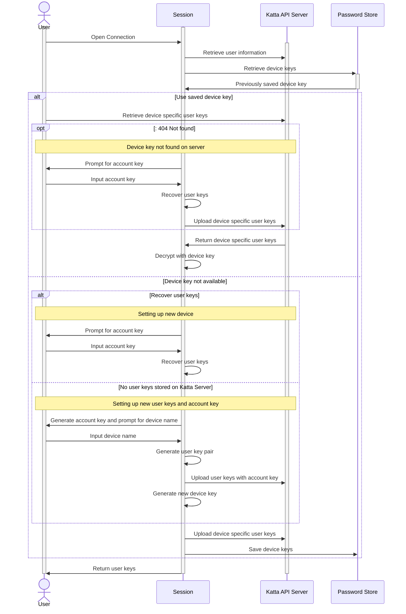
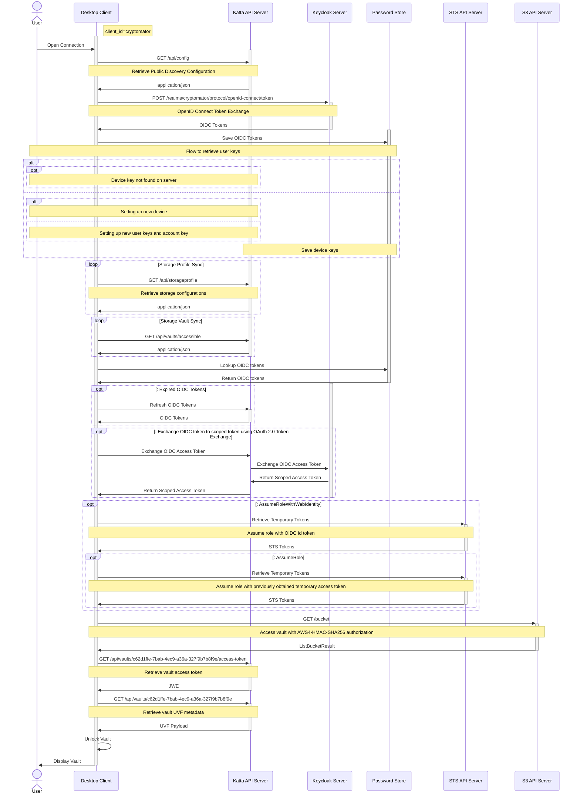

# Katta Architecture

:::note

This document gives a mid-level overview of Katta Architecture through the two central client-side runtime flows: how the Katta
Desktop Client retrieves the user's keys (first login, new device, and account recovery), and how it authenticates and accesses a
vault's storage (OIDC login, token exchange, STS or static storage credentials, and vault unlock). Each diagram is followed by a
step-by-step walkthrough.

For the components and roles involved, see the [Katta Overview](../introduction/OVERVIEW.md). For the cryptographic keys and the
server's trust boundary, see the [Security Architecture](SECURITY.md); for scoped tokens and the storage IAM data model, see
[Katta Token Management](TOKENS.md).

:::

## Flow to retrieve user keys

### In words

This flow shows how the client obtains the user's private [user key pair](SECURITY.md) on a given device. The user key pair is
generated once (at first login) and never leaves the client in plaintext; Katta Server only stores it as JWEs — one encrypted to each
registered device key, and one encrypted with the [Account Key](SECURITY.md) for device-independent recovery.

1. The user opens a connection. The session retrieves the user's account information from Katta API Server and looks in the local
   password store (OS keychain) for a **device key** saved by a previous session.
2. **A device key is available.** The client requests the device-specific user keys — the JWE encrypted to this device — from the
   server.
   * If the server responds `404 Not Found`, this device is not registered on the server. The session prompts for the Account Key,
     recovers the user keys from the Account-Key–encrypted JWE, and uploads a fresh device-specific JWE.
   * Otherwise the server returns the device JWE and the session decrypts it with the device key.
3. **No device key is available** (new device, or the keychain entry was lost).
   * If user keys already exist on the server, this is a new device: the session prompts for the Account Key and recovers the user
     keys from the Account-Key–encrypted JWE.
   * If no user keys exist on the server, this is a brand-new user: the session generates an Account Key, prompts for a device name,
     generates the user key pair, and uploads it encrypted with the Account Key. The Account Key is shown to the user once and must be
     stored safely (e.g. in a password manager).
   * The session then generates a new device key, uploads a device-specific JWE of the user keys, and saves the device key to the
     password store so subsequent sessions take the fast path in step 2.
4. The session returns the decrypted user keys to the caller.

## Flow to authenticate and access vaults

### In words

This flow shows the Katta Desktop Client from opening a connection to displaying an unlocked vault. It uses the `cryptomator`
Keycloak client.

1. **Discovery.** The client fetches `GET /api/config` from Katta API Server to learn the Keycloak endpoints and other public
   configuration.
2. **Authentication.** The client runs an OpenID Connect login against Keycloak, obtains the OIDC tokens (ID, access, refresh), and
   stores them in the local password store.
3. **User keys.** The client runs the [Flow to retrieve user keys](#flow-to-retrieve-user-keys) described above to get the user's
   private keys on this device.
4. **Sync.** The client pulls the storage configurations (`GET /api/storageprofile`) and the vaults the user may access
   (`GET /api/vaults/accessible`).
5. **Token refresh / exchange.** If the OIDC tokens have expired they are refreshed. When a vault-scoped token is required, the client
   asks Katta Server to perform an OAuth 2.0 Token Exchange with Keycloak (targeting the `cryptomatorvaults` client) and returns a
   scoped access token. See [Token Management](TOKENS.md).
6. **Temporary storage credentials (STS Storage Access Mode only).** The client calls `AssumeRoleWithWebIdentity` on the STS API with
   the OIDC ID token to obtain temporary S3 tokens, optionally followed by a second `AssumeRole` for role chaining. In _Static Storage
   Access Mode_ this step is skipped and the S3 static access tokens come from the vault metadata instead.
7. **Storage access.** The client talks to the S3 API directly, authenticating requests with AWS4-HMAC-SHA256.
8. **Vault unlock.** The client retrieves the per-member vault access token
   (`GET /api/vaults/{vaultId}/access-token`, a JWE) and the vault UVF metadata (`GET /api/vaults/{vaultId}`). It decrypts the access
   token with the user's private key to recover the vault member key, unlocks the vault, and displays it to the user.

