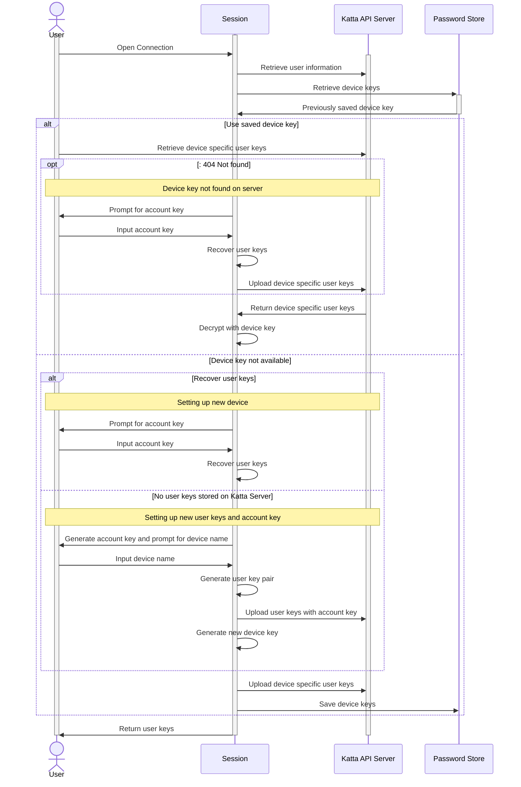
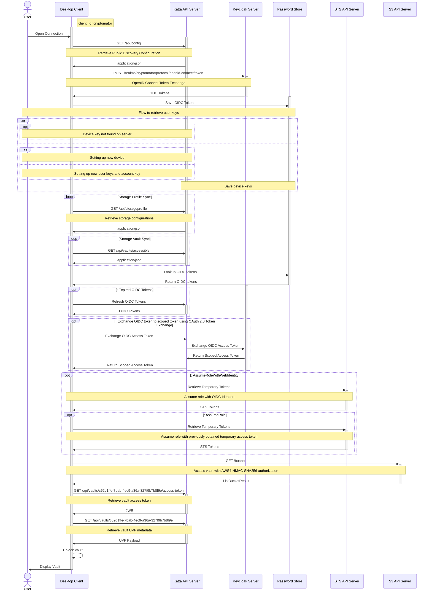

# Katta Architecture

> [!NOTE]  
> This document gives a mid-level overview over Katta Architecture
>

## Flow to retrieve user keys

```mermaid
sequenceDiagram
    actor user as User
    activate user
    participant session as Session
    activate session
    user ->> session: Open Connection
    participant katta as Katta API Server
    activate katta
    session ->> katta: Retrieve user information
    participant keychain as Password Store
    session ->>+ keychain: Retrieve device keys
    keychain ->>- session: Previously saved device key
    alt Use saved device key
        user ->> katta: Retrieve device specific user keys
        opt : 404 Not found
            Note over user, katta: Device key not found on server
            session ->> user: Prompt for account key
            user ->> session: Input account key
            session ->> session: Recover user keys
            session ->> katta: Upload device specific user keys
        end
        katta ->> session: Return device specific user keys
        session ->> session: Decrypt with device key
    else Device key not available
        alt Recover user keys
            Note over user, katta: Setting up new device
            session ->> user: Prompt for account key
            user ->> session: Input account key
            session ->> session: Recover user keys
        else No user keys stored on Katta Server
            Note over user, katta: Setting up new user keys and account key
            session ->> user: Generate account key and prompt for device name
            user ->> session: Input device name
            session ->> session: Generate user key pair
            session ->> katta: Upload user keys with account key
            session ->> session: Generate new device key
        end
        session ->> katta: Upload device specific user keys
        session ->> keychain: Save device keys
    end
    session ->> user: Return user keys
    deactivate katta
    deactivate session
    deactivate user
```

## Flow to authenticate and access vaults

```mermaid
sequenceDiagram
    actor User
    participant client as Desktop Client
    participant katta as Katta API Server
    Note right of client: client_id=cryptomator
    activate client
    User ->> client: Open Connection
    activate katta
    client ->> katta: GET /api/config
    Note over client, katta: Retrieve Public Discovery Configuration
    katta ->> client: application/json
    participant keycloak as Keycloak Server
    activate keycloak
    client ->>+ keycloak: POST /realms/cryptomator/protocol/openid-connect/token
    Note over client, keycloak: OpenID Connect Token Exchange
    keycloak ->>- client: OIDC Tokens
    participant keychain as Password Store
    activate keychain
    client ->> keychain: Save OIDC Tokens
    Note over User, keychain: Flow to retrieve user keys
    alt
        opt
            Note over User, katta: Device key not found on server
        end
    else
        alt
            Note over User, katta: Setting up new device
        else
            Note over User, katta: Setting up new user keys and account key
        end
        Note over katta, keychain: Save device keys
    end

    loop Storage Profile Sync
        client ->> katta: GET /api/storageprofile
        Note over client, katta: Retrieve storage configurations
        katta ->> client: application/json
    end
    loop Storage Vault Sync
        client ->> katta: GET /api/vaults/accessible
        katta ->> client: application/json
    end
    deactivate katta
    client ->> keychain: Lookup OIDC tokens
    keychain ->> client: Return OIDC tokens
    deactivate keychain
    activate keycloak

    opt : Expired OIDC Tokens
        client ->>+ katta: Refresh OIDC Tokens
        katta ->>- client: OIDC Tokens
    end

    opt : Exchange OIDC token to scoped token using OAuth 2.0 Token Exchange
        client ->> katta: Exchange OIDC Access Token
        katta ->> keycloak: Exchange OIDC Access Token
        keycloak ->> katta: Return Scoped Access Token
        katta ->> client: Return Scoped Access Token
    end
    deactivate keycloak

    opt : AssumeRoleWithWebIdentity
        participant sts as STS API Server
        client ->>+ sts: Retrieve Temporary Tokens
        Note over client, sts: Assume role with OIDC Id token
        sts ->>- client: STS Tokens
        opt : AssumeRole
            client ->>+ sts: Retrieve Temporary Tokens
            Note over client, sts: Assume role with previously obtained temporary access token
            sts ->>- client: STS Tokens
        end
    end

    participant s3 as S3 API Server
    client ->>+ s3: GET /bucket
    Note over client, s3: Access vault with AWS4-HMAC-SHA256 authorization
    s3 ->>- client: ListBucketResult
    client ->>+ katta: GET /api/vaults/c62d1ffe-7bab-4ec9-a36a-327f9b7b8f9e/access-token
    Note over client, katta: Retrieve vault access token
    katta ->>- client: JWE
    client ->>+ katta: GET /api/vaults/c62d1ffe-7bab-4ec9-a36a-327f9b7b8f9e
    Note over client, katta: Retrieve vault UVF metadata
    katta ->>- client: UVF Payload
    client ->> client: Unlock Vault
    client ->>+ User: Display Vault
    deactivate client
```

