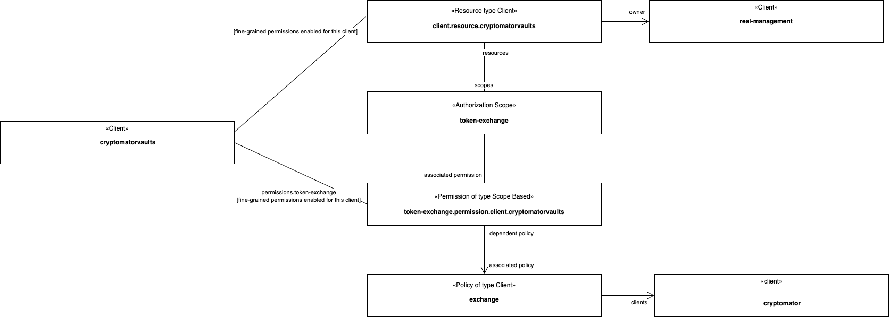

# Keycloak

## Keycloak Data Model and Katta Server to Keycloak Sync

Upstream (Cryptomator Hub) uses realm roles for controlling access to backend services. Currently, there are the `user`, `create-vaults` and `admin` roles.
These roles must be in the `realm_access.roles` claim of the access token issued by the `cryptomator` and `cryptomatorhub` clients, as it is used to call the
backend API.
The privileged access that the Katta Server needs for the synchronization described below does not come from a realm role: the backend
authenticates as the `cryptomatorhub-system` service account client (`hub.keycloak.system-client-id`), which holds the `realm-management` client roles
`realm-admin` and `view-system`. The client itself is inherited from upstream; Katta additionally grants it the `admin` realm role.
Therefore, we use client roles added to client scopes instead of realm roles to control storage access to vaults.

The following diagram shows the data model used in Keycloak:

This means that only users with both

- the client-level role `<vaultId>`
- requesting the scope `<vaultId>`

get the claims mapped in by the vault-specific (hard-coded) protocol mapper.

The following table lists the events that sync data to Keycloak in line with this data model:

| Vault Server Event            | Sync to Keycloak                                                                                                                            |
|-------------------------------|---------------------------------------------------------------------------------------------------------------------------------------------|
| Create vault                  | Create optional client scope and client role in `cryptomatorvaults` both with name `<vaultId>` and add protocol mapper to the client scope. |
| Share vault access with user  | Add client role `<vaultId>` in `cryptomatorvaults` client to user.                                                                          |
| Remove vault access from user | Remove client role `<vaultId>` in `cryptomatorvaults` client from user.                                                                     |

## Token Exchange

We add a custom [OIDC Token Exchange Provider](https://www.keycloak.org/securing-apps/token-exchange) by implementing a
Keycloak [Service Provider Interface (SPI)](https://www.keycloak.org/server/configuration-provider):

- if both
    - if there is exactly one requested `scope`
    - if there is exactly one value in the requested `audience` and it correspond to a `client`
- then return a token from the target client, with the `aud` claim filled by the target client
- else default behaviour

In this way, only users with the corresponding client role get the claims required to access the vault's data.

## Keycloak Realm Diff to Cryptomator Hub (aka. Upstream)

The realm deployed by Katta Server is rendered from the Helm chart's
[realm template](https://github.com/shift7-ch/katta-server/blob/feature/cipherduck-uvf/chart/templates/_realm.tpl). It has several differences to the
corresponding [upstream realm template](https://github.com/cryptomator/hub/blob/develop/chart/templates/_realm.tpl):

| Diff                                                                                                                                                          | Motivation                                                                                                                                                                                                                                                                            |
|-----------------------------------------------------------------------------------------------------------------------------------------------------------------|-------------------------------------------------------------------------------------------------------------------------------------------------------------------------------------------------------------------------------------------------------------------------------------|
| add `cryptomatorvaults` client, with `standard.token.exchange.enabled` and its default client scopes restricted to `basic`                                     | Separate client holding the vault-specific client scopes and roles, keeping these data apart from the data used upstream; it is the target of the token exchange. Restricting the default scopes keeps the per-vault client roles out of the token — with one client role per vault the token would otherwise grow with the number of vaults and quickly hit token size limits at AWS. The `basic` scope has to be listed explicitly because the list is overridden, and it carries the `sub` claim required for STS.[^3] |
| add `oidc-audience-mapper` to `cryptomatorhub` (audience `cryptomator`) and to `cryptomator` (audiences `cryptomator` and `cryptomatorvaults`)                | `aud` claim is required for STS                                                                                                                                                                                                                                                       |
| add `oidc-usermodel-realm-role-mapper` to the `cryptomator` client                                                                                             | Upstream defines no protocol mappers on this client; the backend API expects the realm roles in the `realm_access.roles` claim.                                                                                                                                                       |
| remove the `client roles` mapper (`oidc-usermodel-client-role-mapper`, claim `resource_access.${client_id}.roles`) from the `cryptomatorhub` client            | Client roles must not be added to access tokens by default, for the same token size reason as above.                                                                                                                                                                                  |
| add `x-katta-action:oauth` to `redirectUris` of the `cryptomator` client                                                                                      | Custom URL scheme used by _Katta Desktop_ to receive the authorization code of the OAuth Authorization Code Flow.                                                                                                                                                                     |

Apart from these, the template differs from upstream in branding only (`displayName`, `loginTheme` and client display names).

For more details, see the tests in the `keycloak` module of Katta Server.

The following diagram shows the wiring of the Keycloak realm to allow token exchange:

[^3]:  Keycloak 25 introduces mapper for `sub` claim in scope `basic`, the scope needs to added explicitly to the default scopes list as we override the
list (in order to remove the `roles` scope),
see  [Migrating to Keycloak 25.0.0](https://www.keycloak.org/docs/latest/upgrading/index.html#new-default-client-scope-basic)
and [Release Notes Keycloak 25.0.0](https://www.keycloak.org/docs/latest/release_notes/#keycloak-25-0-0)
