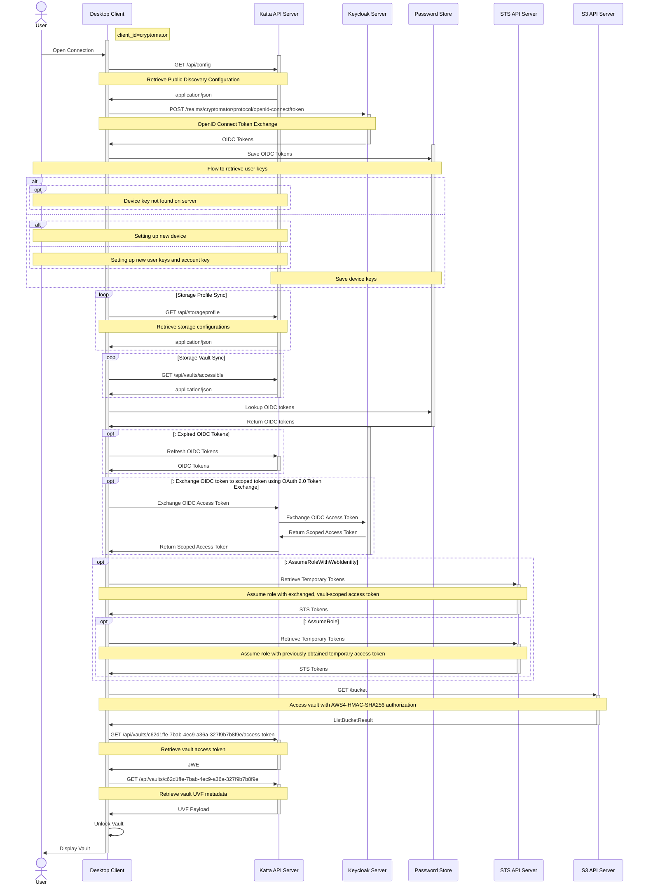
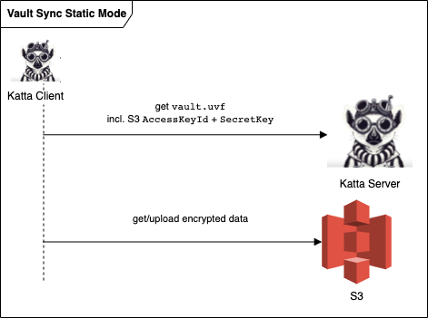
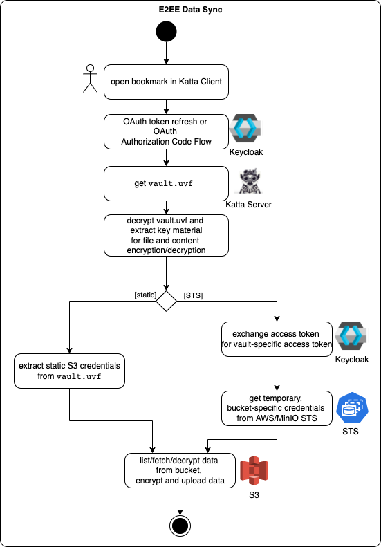

# Storage Access

## Authenticating and Unlocking a Vault

This flow shows the Katta Desktop Client from opening a connection to displaying an unlocked vault. It uses the `cryptomator`
Keycloak client.

1. **Discovery.** The client fetches `GET /api/config` from Katta API Server to learn the Keycloak endpoints and other public
   configuration.
2. **Authentication.** The client runs an OpenID Connect login against Keycloak, obtains the OIDC tokens (ID, access, refresh), and
   stores them in the local password store.
3. **User keys.** The client runs the [User Keys](user-keys.md) flow to get the user's
   private keys on this device.
4. **Sync.** The client pulls the storage configurations (`GET /api/storageprofile`) and the vaults the user may access
   (`GET /api/vaults/accessible`).
5. **Token refresh / exchange.** If the OIDC tokens have expired they are refreshed. When a vault-scoped token is required, the client
   asks Katta Server to perform an OAuth 2.0 Token Exchange with Keycloak (targeting the `cryptomatorvaults` client) and returns a
   scoped access token. See [Tokens](tokens.md).
6. **Temporary storage credentials (STS Storage Access Mode only).** The client calls `AssumeRoleWithWebIdentity` on the STS API with
   the exchanged, vault-scoped access token to obtain temporary S3 tokens, optionally followed by a second `AssumeRole` for role
   chaining. In _Static Storage Access Mode_ this step is skipped and the S3 static access tokens come from the vault metadata instead.
7. **Storage access.** The client talks to the S3 API directly, authenticating requests with AWS4-HMAC-SHA256.
8. **Vault unlock.** The client retrieves the per-member vault access token
   (`GET /api/vaults/{vaultId}/access-token`, a JWE) and the vault UVF metadata (`GET /api/vaults/{vaultId}`). It decrypts the access
   token with the user's private key to recover the vault member key, unlocks the vault, and displays it to the user.

## E2E-Encrypted Data Sync

### Static Storage Access Mode

The following diagram illustrates the interactions when Katta Desktop syncs data in a vault in [_Static Storage Access Mode_](../concepts.md#s3-storage-access):
* `vault.uvf` (vault metadata) contains the S3 access configuration (credentials `AccessKeyId` and `SecretKey` and bucket configuration (region, custom endpoint etc.)), as well as the encryption keys; it is stored encrypted in Katta Server.
* With the encryption keys from `vault.uvf`, Katta Desktop encrypts and decrypts data on the fly before it leaves the local machine on the way to/from S3 bucket.

### STS Storage Access Mode

The following diagram illustrates the interactions when Katta Desktop syncs data in a vault in [_STS Storage Access Mode_](../concepts.md#s3-storage-access):
* `vault.uvf` (vault metadata) contains the S3 access configuration (e.g. roles to be used with STS and bucket configuration like region or custom
  endpoint), as
  well as the encryption keys; it is stored encrypted in Katta Server.
* The OIDC access token that is used to communicate with Katta Server is exchanged for a token with vault-specific claims
* When sent to STS, the vault-specific claims will be evaluated to issue temporary fine-grained S3 credentials giving access to the vault's bucket only
* With the encryption keys from `vault.uvf`, Katta Desktop encrypts and decrypts data on the fly before it leaves the local machine on the way to/from S3 bucket.

## Comparison of Flow to Access Vaults in both _Static_ and _STS Storage Access Modes_

The following diagram illustrates the flow of actions to sync data in an end-to-end-encrypted way:
* A user opens the vault in Katta Desktop.
* If Katta Desktop does not have a valid OIDC access token, it refreshes it or starts
  an [OIDC Authorization Code Grant Flow](https://www.rfc-editor.org/rfc/rfc6749#page-24), asking the user to authenticate in the browser against Keycloak to
  issue a new access token.
* `vault.uvf` (vault metadata) JWE is fetched from Katta Server and
* decrypted with the Vault Member Key to get the keys for data encryption/decryption and storage access configuration.

