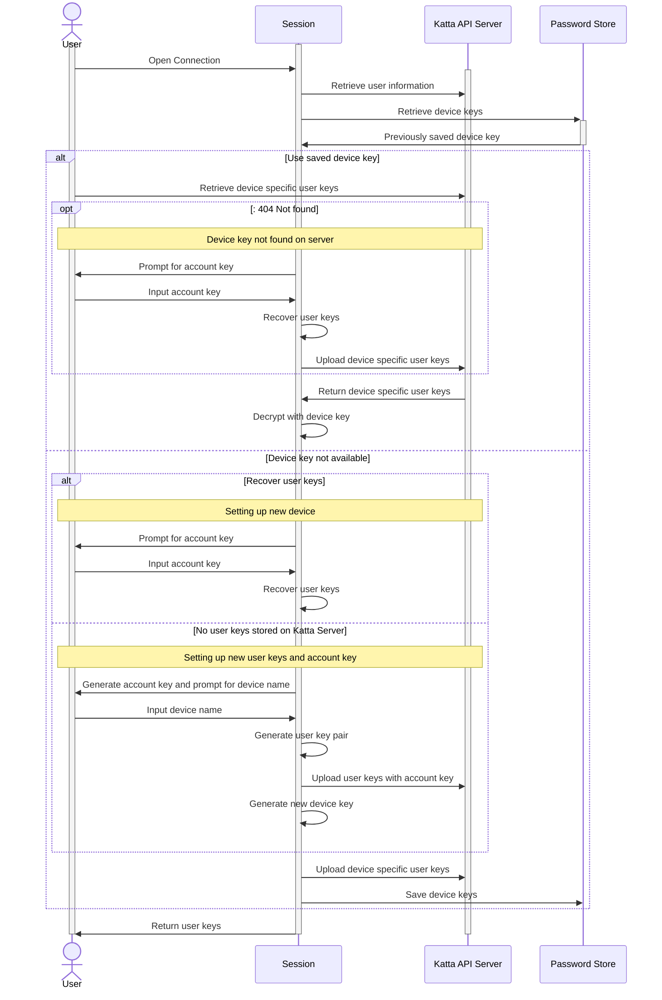

# User Keys

This flow shows how the client obtains the user's private [user key pair](security.md) on a given device. The user key pair is
generated once (at first login) and never leaves the client in plaintext; Katta Server only stores it as JWEs — one encrypted to each
registered device key, and one encrypted with the [Account Key](security.md) for device-independent recovery.

1. The user opens a connection. The session retrieves the user's account information from Katta API Server and looks in the local
   password store (OS keychain) for a **device key** saved by a previous session.
2. **A device key is available.** The client requests the device-specific user keys — the JWE encrypted to this device — from the
   server.
    * If the server responds `404 Not Found`, this device is not registered on the server. The session prompts for the Account Key,
      recovers the user keys from the Account-Key–encrypted JWE, and uploads a fresh device-specific JWE.
    * Otherwise the server returns the device JWE and the session decrypts it with the device key.
3. **No device key is available** (new device, or the keychain entry was lost).
    * If user keys already exist on the server, this is a new device: the session prompts for the Account Key and recovers the user
      keys from the Account-Key–encrypted JWE.
    * If no user keys exist on the server, this is a brand-new user: the session generates an Account Key, prompts for a device name,
      generates the user key pair, and uploads it encrypted with the Account Key. The Account Key is shown to the user once and must be
      stored safely (e.g. in a password manager).
    * The session then generates a new device key, uploads a device-specific JWE of the user keys, and saves the device key to the
      password store so subsequent sessions take the fast path in step 2.
4. The session returns the decrypted user keys to the caller.

