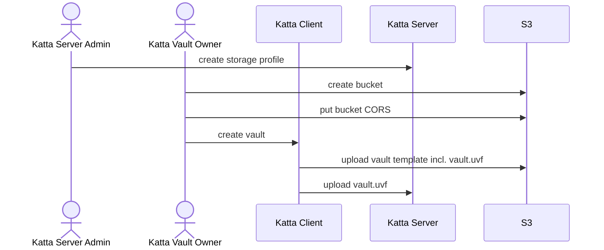
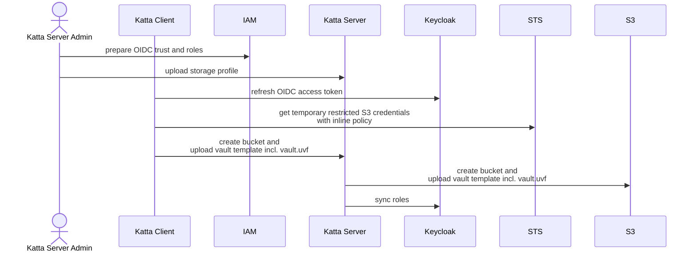
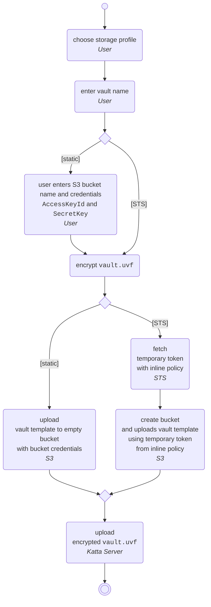

# Vault Creation

:::tip[Katta Desktop]
See the [Katta Desktop Guide](../user-guide/desktop-setup.md#create-a-new-vault) for user instructions.
:::

## Static Storage Access Mode

The following diagram illustrates the interactions when a user creates a vault in [_Static Storage Access Mode_](../concepts.md#s3-storage):

In words:

* A Katta Server admin (role `admin`) needs to define the possible S3 endpoints for Katta _Static Storage Access Mode_ where users can create vaults.
  Admins upload storage profiles via the backend API and can inspect them in Katta Web.
* To create a vault in _Static Storage Access Mode_ in Katta Web, a bucket first needs to be created manually ([AWS console](https://aws.amazon.com/console/)
  or [AWS CLI](https://aws.amazon.com/cli/)) with the correct bucket CORS settings (see [Troubleshooting](../self-hosting-guide/troubleshooting.md)).
* A Katta user (role `create-vaults`) can create vaults based on the storage profile and the bucket and access credentials. The vault creator becomes the first
  Vault Owner.
* Finally, Katta Desktop verifies the configuration and uploads the `vault.uvf` (vault metadata) to the S3 bucket and to Katta Server.

## STS Storage Access Mode

The following diagram illustrates the interactions when a user creates a vault in [_STS Storage Access Mode_](../concepts.md#s3-storage):

In words:

* A technical admin needs to prepare OIDC trust and roles in AWS or MinIO IAM and define an _STS Storage Access Mode_ storage profile in Katta Server.
* Katta Desktop refreshes the user's access token.
* The access token is sent to STS with an inline policy in order to issue temporary credentials that allow for the creation of a specific bucket.
* In Katta Web, the temporary S3 credentials are sent to Katta Server, which calls S3 to create the corresponding bucket on the user's behalf. This is
  necessary because a browser cannot create a bucket and use it right away (CORS restrictions). The Desktop Client is not bound by CORS and creates the bucket
  itself, without involving Katta Server.
* Finally, Katta Desktop then uploads the `vault.uvf` with the access configuration, and the vault members are synced to Keycloak.

:::info[Why does Katta Server create the bucket for Katta Web in STS Storage Access Mode?]
Only **Katta Web** delegates bucket creation to Katta Server, and only because it runs in a browser. A browser cannot create a bucket, configure its CORS
settings, and upload to it in one shot — and S3 does not offer bucket creation and CORS configuration as a joint operation. So the Katta Web assumes the
`katta-create-bucket` role and hands the resulting temporary credentials to Katta Server, which creates the bucket and uploads the vault template on the
user's behalf; server-side calls are not subject to browser CORS restrictions.

The **Desktop Client** is not a browser and is not bound by CORS, so it does not involve Katta Server: it assumes the `katta-create-bucket` role and
creates the bucket itself. See [Tokens](tokens.md#scoped-tokens-for-s3-storage-access) for the full flow.
:::

## Comparison of Flow to Create Vaults in both _Static_ and _STS Storage Access Modes_

The following diagram illustrates the flow of actions to create a vault in the two modes:

