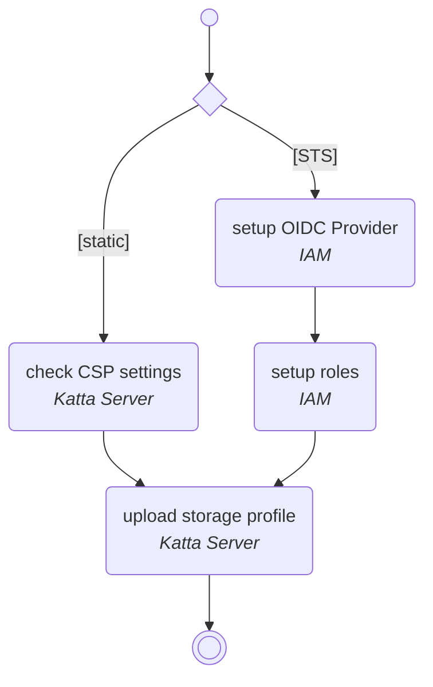

import DocCardList from '@theme/DocCardList';

# Self-Hosting Guide

This guide is for everyone who runs a Katta Server instance on their own infrastructure. It covers deploying the server, and preparing AWS or MinIO so the server can hand out storage credentials.

:::note
A managed Katta Server, hosted and maintained by shift7 GmbH, is not currently available. You must self-host Katta Server.
:::

The setup path depends on the [Storage Access Mode](../concepts.md#s3-storage-access) the server will offer:

Once the server runs and its storage provider is prepared, the [Admin Guide](../admin-guide/index.md) covers the storage profiles that put it to use.

<DocCardList />
