import Tabs from '@theme/Tabs';
import TabItem from '@theme/TabItem';

# Desktop Setup

This document describes step-by-step how to set up Katta Desktop on macOS or Windows, covering:

* Install Katta Desktop
* Authenticate with Katta Server
* Set up your Account Key
* Create a new vault
* Add files to a vault

See [Concepts](../concepts.md) for the vocabulary this page uses.

:::info[Prerequisite]

This page assumes a running Katta Server with at least one [storage profile](../admin-guide/storage-profiles.md) configured, and a user account
with the `create-vaults` role.

:::

## Install Katta Desktop

Download Katta Desktop from the Katta Web application of your Katta Server and install it:

<Tabs groupId="os" queryString>
<TabItem value="macos" label="macOS">

Open the `.zip` or `.dmg` and drag **Katta.app** into your *Applications* folder.

</TabItem>
<TabItem value="windows" label="Windows">

Open the `.msix` package and follow the wizard.

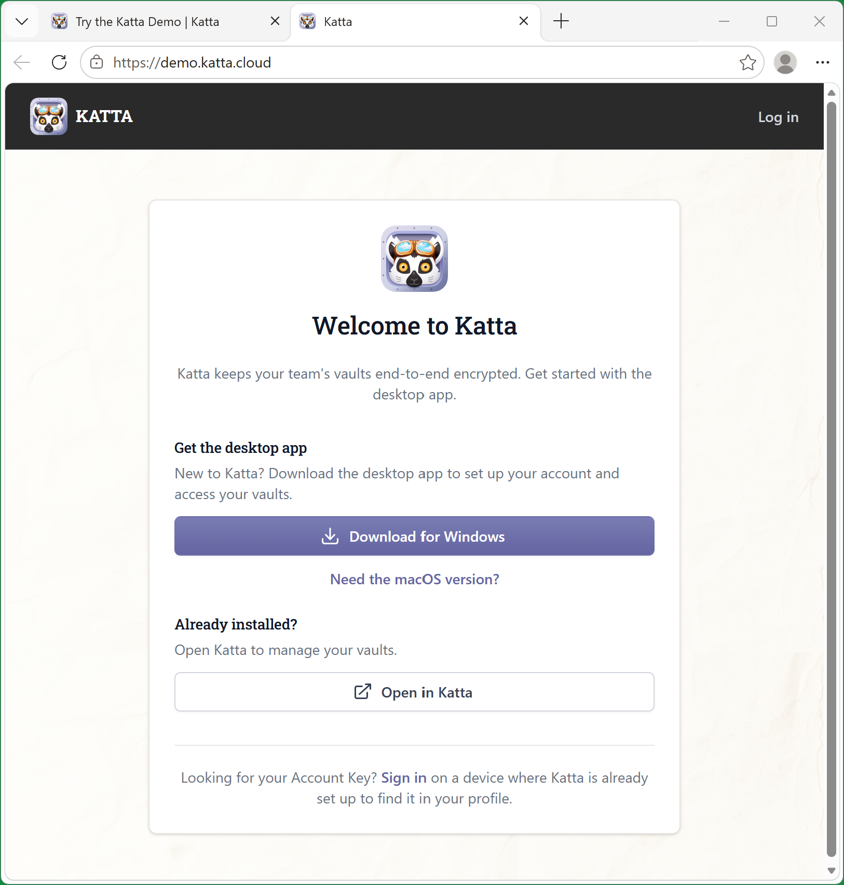

</TabItem>
</Tabs>

## Authenticate with Katta Server

Choose _Open in Katta_ from the Katta Web application of your Katta Server, or open the connection prompt manually with
_Open Connection…_ from the Katta Desktop menu and enter the server hostname.

<Tabs groupId="os" queryString>
<TabItem value="macos" label="macOS">

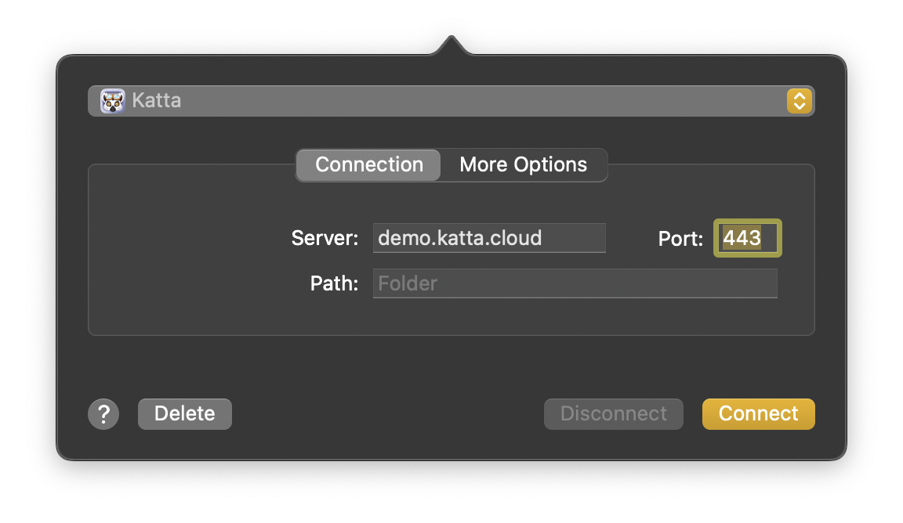

</TabItem>
<TabItem value="windows" label="Windows">

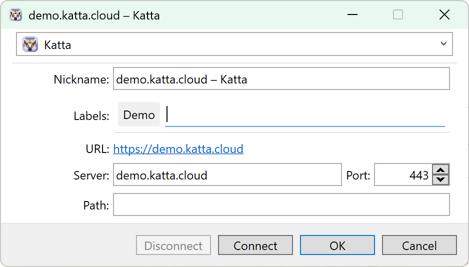

</TabItem>
</Tabs>

Katta Desktop opens your web browser to obtain an authorization code and shows the prompt below until you finish signing in
(select **Cancel** to abort).

<Tabs groupId="os" queryString>
<TabItem value="macos" label="macOS">

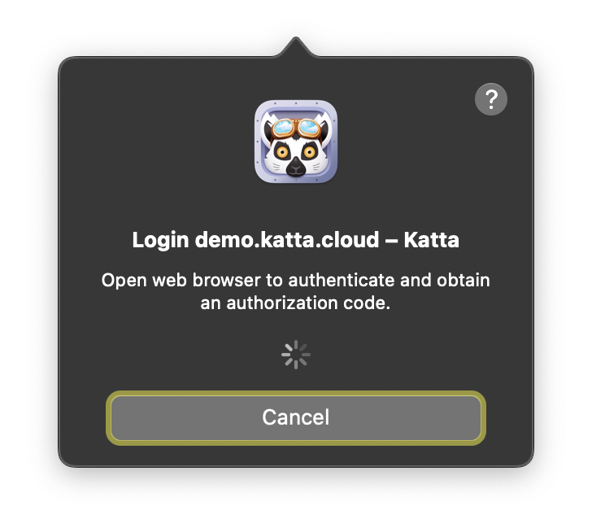

</TabItem>
<TabItem value="windows" label="Windows">

_Windows screenshot pending._

</TabItem>
</Tabs>

Your browser opens the Katta Web sign-in page. Enter your username (or email) and password and select **Sign In**. If your
organization connects an external identity provider (OpenID Connect, SAML, or LDAP), authenticate there instead.

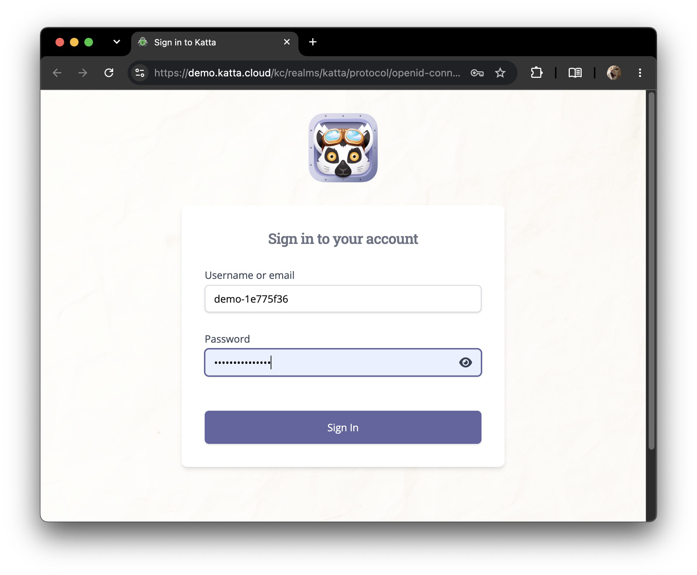

After a successful sign-in the browser passes the authorization code back to Katta Desktop; you can then close the browser tab.

## Set up your Account Key

The first time you authenticate on a device, Katta Desktop handles your **Account Key** — a high-entropy secret that protects your
personal key pair and lets you recover it on other apps, browsers, and devices. Katta Server never sees the Account Key. Refer to [User Keys](../architecture/user-keys.md).

**New user.** Katta Desktop generates the Account Key. Copy it to a safe place, for example a password manager. Then confirm the
dialog:

<Tabs groupId="os" queryString>
<TabItem value="macos" label="macOS">

Tick **I stored my Account Key securely**, then select **Finish Setup**.

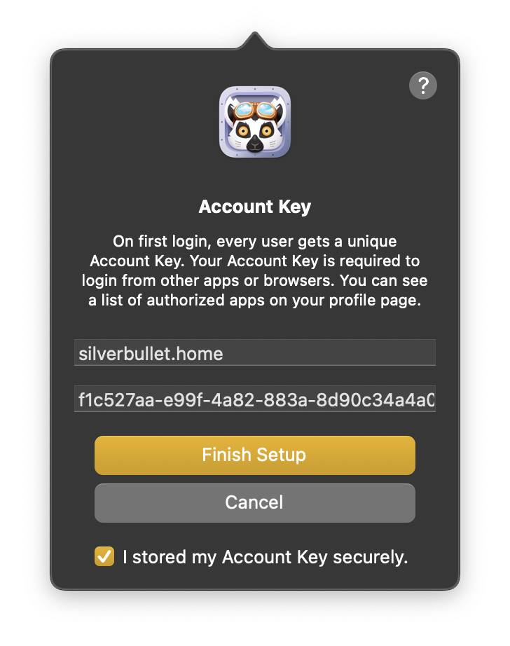

</TabItem>
<TabItem value="windows" label="Windows">

Enter a device name. Keep **Save Password** ticked, then select **Login**.

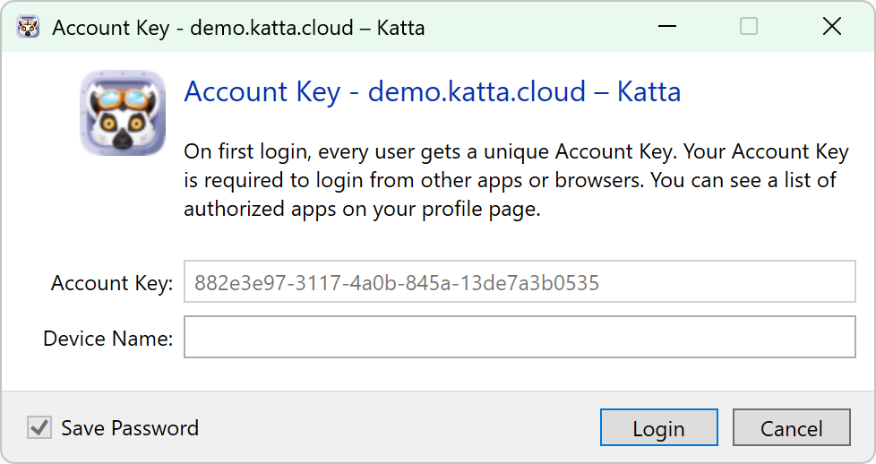

</TabItem>
</Tabs>

**New device.** If you already created your Account Key on another app or browser (for example when signing in to Katta Web), enter
it here to unlock your key pair on this device.

<Tabs groupId="os" queryString>
<TabItem value="macos" label="macOS">

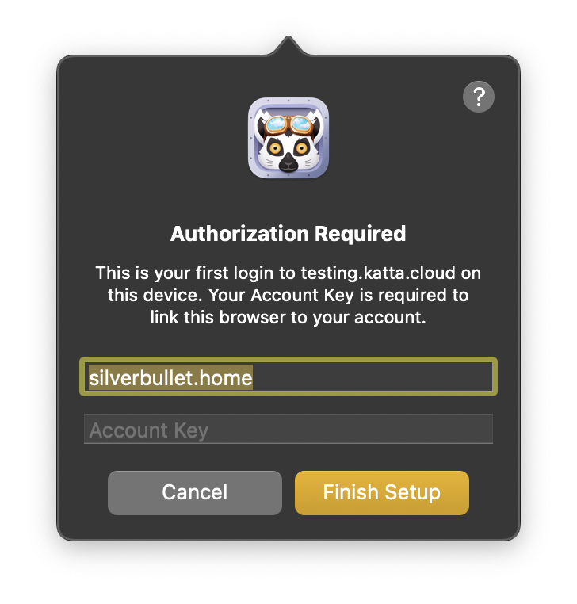

</TabItem>
<TabItem value="windows" label="Windows">

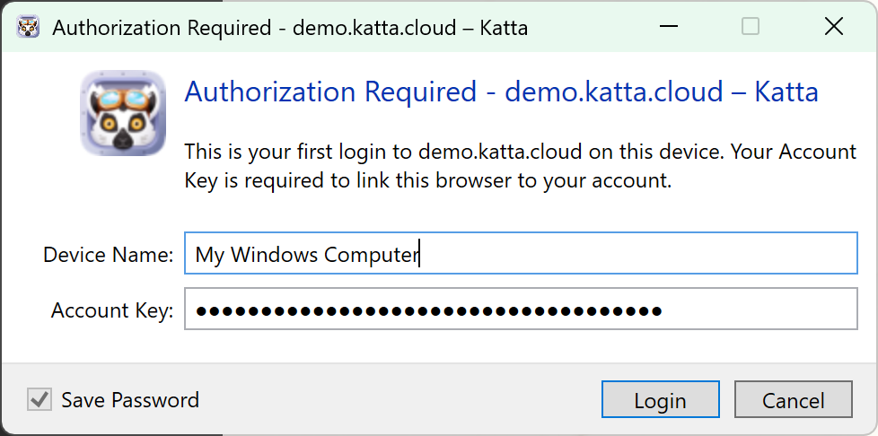

</TabItem>
</Tabs>

:::info[Authorized Devices]
You can review the apps and devices authorized with your Account Key on your profile page in Katta Web. See
[User Keys](../architecture/user-keys.md) for what happens behind the scenes.
:::

## Create a new vault

:::tip[Katta Web]
Creating a new vault in Katta Web is also supported with [limitations](../architecture/vault-creation.md).
:::

Once authenticated, Katta Server is mounted as a location (for example *Katta – demo.katta.cloud*).

**1. Add a new vault.** Open the Katta location and secondary-click (right-click) an empty area. On macOS, choose
**New Encrypted Vault…**. On Windows, choose **Katta** and then **New Encrypted Vault…**.

<Tabs groupId="os" queryString>
<TabItem value="macos" label="macOS">

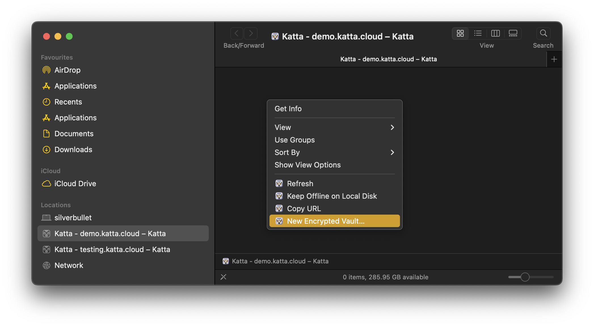

</TabItem>
<TabItem value="windows" label="Windows">

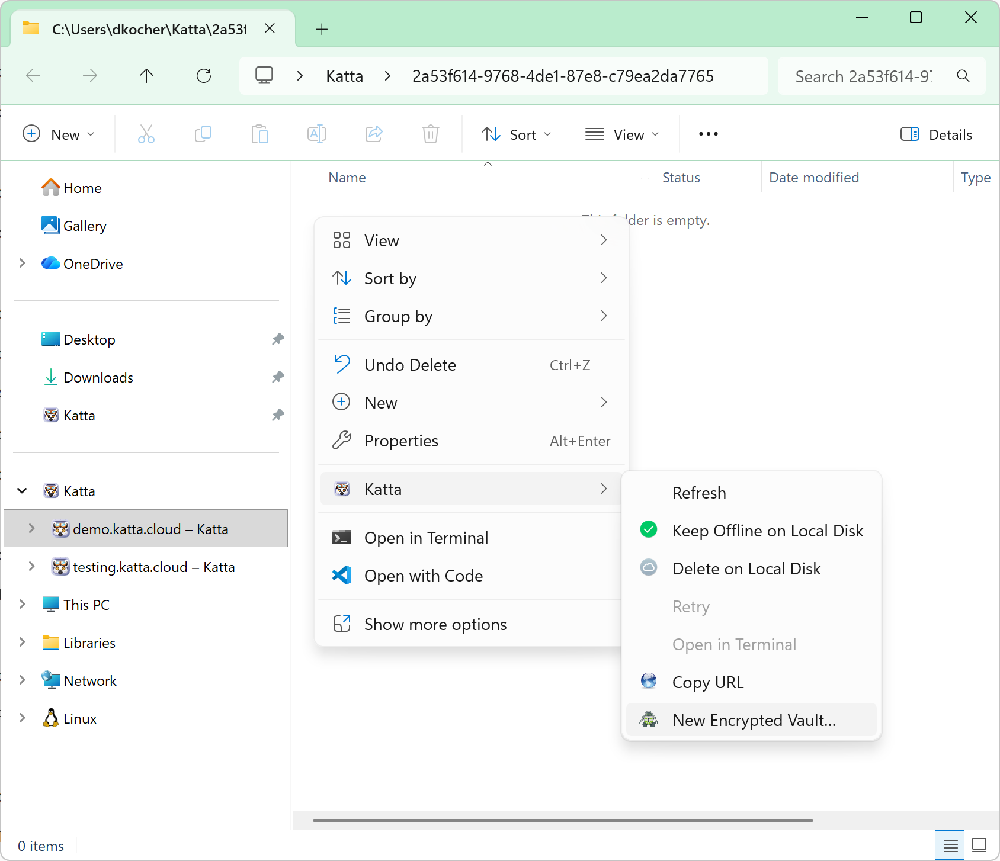

</TabItem>
</Tabs>

**2. Name it and choose a storage profile.** Enter a name for the vault and pick a **storage profile** from the dropdown. The list
contains the storage locations your administrator configured (see [Storage Profiles](../admin-guide/storage-profiles.md)); the value in
parentheses is the region the bucket is created in. Select **Create Vault**.

<Tabs groupId="os" queryString>
<TabItem value="macos" label="macOS">

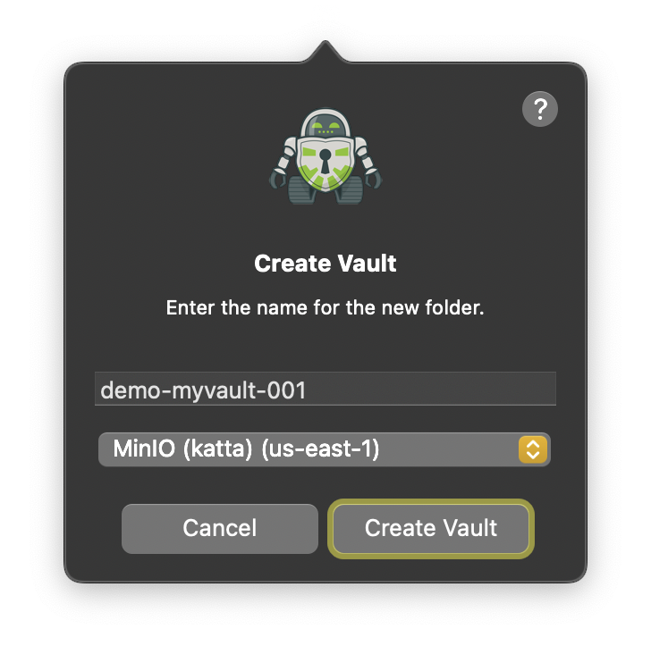

</TabItem>
<TabItem value="windows" label="Windows">

_Windows screenshot pending._

</TabItem>
</Tabs>

Katta Desktop creates the storage bucket, uploads the encrypted vault template, and registers the vault keys with Katta Server
(encrypted on your computer).

:::info[Share Vault]
You become the vault owner and can share the vault with other Katta users from Katta Web.
:::

## Add files to a vault

The vault appears as a folder inside the Katta location. Work with it like any other folder: drag files and folders into it in
Finder on macOS or File Explorer on Windows, or save into it from an application. Katta Desktop syncs the contents to the vault's S3
bucket in the background; opening a file downloads and decrypts it on demand.

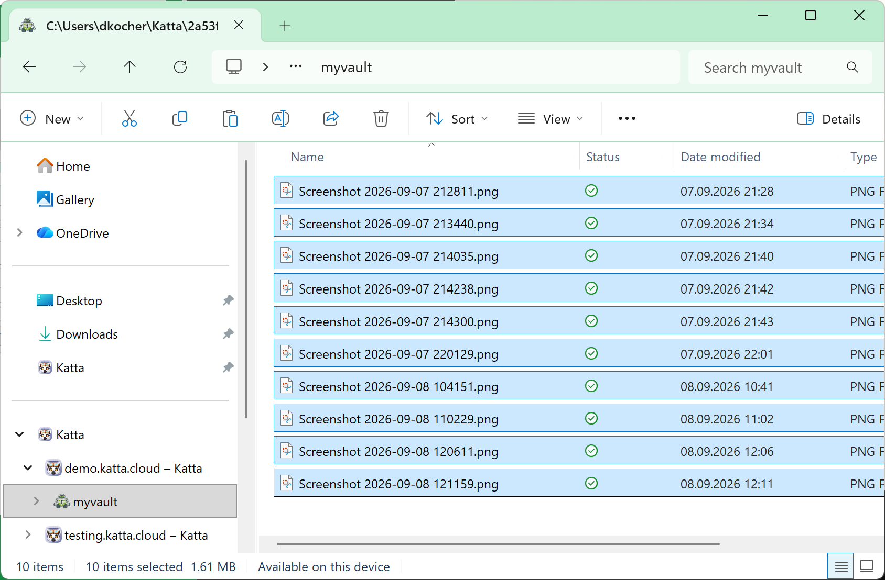

:::info[Zero-knowledge, end-to-end encrypted]
Everything you put in a vault is encrypted on your computer before it is uploaded, and decrypted again only on the computer of a
vault member. File contents **and** file and folder names are encrypted; the S3 bucket holds only ciphertext. See [Security](../architecture/security.md) and [E2E-Encrypted Data Sync](../architecture/storage-access.md#e2e-encrypted-data-sync) for details.
:::
